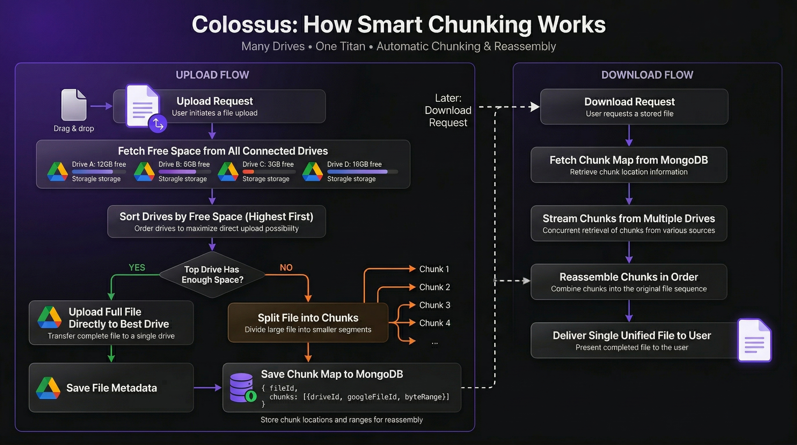

# Colossus

<p align="center">
  
</p>

### Many drives. One titan.

**Colossus** is an open-source cloud storage platform that merges multiple Google Drive accounts into a single, unified storage pool. Connect as many Google Drive accounts as you want - Colossus handles the rest, automatically splitting large files across drives and reassembling them seamlessly on download.


--

## What is Colossus?

Every free Google account comes with **15 GB** of Drive storage. Colossus lets you connect *any number* of Google accounts and treats them as a single, massive drive.

- 3 accounts → **45 GB**
- 10 accounts → **150 GB**
- 20 accounts → **300 GB**

No subscriptions. No paid tiers. Just your own Google accounts, unified.

---

## Features

- **Unified Storage Pool** - Browse, search, and manage files across all connected drives from one interface
- **Smart Auto-Chunking** - Files too large for a single drive are automatically split across multiple drives and reassembled transparently on download
- **Storage Intelligence** - Colossus always writes to the drive with the most free space first, minimizing unnecessary splits
- **Secure Auth** - Platform login via JWT + Google Drive connected via OAuth 2.0 (your credentials never touch our servers)
- **Storage Dashboard** - See total, used, and free space across all drives individually and combined
- **File Management** - Upload via drag & drop, search by name, download (with auto-merge for chunked files), and delete
- **Glassmorphism UI** - Dark, premium interface built with Tailwind CSS + DaisyUI

---

## Tech Stack

| Layer | Technology |
|-------|-----------|
| Frontend | React 18, Vite, Tailwind CSS, DaisyUI |
| Backend | Node.js, Express |
| Database | MongoDB + Mongoose |
| Auth | JWT (platform) + Google OAuth 2.0 (Drive) |
| Storage | Google Drive API v3 |
| Fonts | Syne (display), DM Sans (body), JetBrains Mono |

---

## Project Structure

```
colossus/
├── backend/
│   ├── models/
│   │   ├── User.js              # User schema with driveAccounts[]
│   │   └── FileMetadata.js      # File + chunk map metadata
│   ├── routes/
│   │   ├── authRoutes.js        # Register, login, /me
│   │   ├── driveRoutes.js       # Connect/disconnect/list drives + quota
│   │   └── fileRoutes.js        # Upload, list, download, delete
│   ├── middleware/
│   │   └── authMiddleware.js    # JWT protect + optionalAuth
│   ├── utils/
│   │   └── googleDrive.js       # OAuth helpers, Drive client, quota fetching
│   └── server.js
└── frontend/
    └── src/
        ├── pages/               # LandingPage, LoginPage, RegisterPage, DashboardPage
        ├── components/
        │   ├── dashboard/       # Sidebar
        │   ├── files/           # FilesPanel, FileCard, UploadZone
        │   └── drives/          # DrivesPanel, StoragePanel
        ├── context/             # AuthContext (JWT + user state)
        └── utils/               # api.js (Axios), helpers.js
```

---

## Setup & Installation

### Prerequisites

- Node.js ≥ 18
- MongoDB (local or Atlas)
- A Google Cloud project with OAuth credentials

---

### Step 1 — Google Cloud Setup

1. Go to [console.cloud.google.com](https://console.cloud.google.com) and create a new project
2. Navigate to **APIs & Services** → **Enable APIs** → enable **Google Drive API**
3. Go to **Credentials** → **Create Credentials** → **OAuth 2.0 Client ID**
4. Set application type to **Web application**
5. Add this to **Authorized redirect URIs**:
   ```
   http://localhost:5000/api/drives/oauth/callback
   ```
6. Copy your **Client ID** and **Client Secret**
7. Go to **OAuth consent screen** → add your email(s) as test users

---

### Step 2 - Backend

```bash
cd backend
npm install
cp .env.example .env
```

Fill in your `.env`:

```env
PORT=5000
MONGO_URI=mongodb://localhost:27017/colossus
JWT_SECRET=your_long_random_secret_here
JWT_EXPIRES_IN=7d

GOOGLE_CLIENT_ID=your_google_client_id
GOOGLE_CLIENT_SECRET=your_google_client_secret
GOOGLE_REDIRECT_URI=http://localhost:5000/api/drives/oauth/callback

CLIENT_URL=http://localhost:5173
```

```bash
npm run dev
```

---

### Step 3 - Frontend

```bash
cd frontend
npm install
npm run dev
```

Visit `http://localhost:5173` 🎉

---

## API Reference

### Auth

| Method | Endpoint | Description |
|--------|----------|-------------|
| `POST` | `/api/auth/register` | Create a new account |
| `POST` | `/api/auth/login` | Login and receive JWT |
| `GET` | `/api/auth/me` | Get current user (protected) |
| `PUT` | `/api/auth/me` | Update display name (protected) |

### Drives

| Method | Endpoint | Description |
|--------|----------|-------------|
| `GET` | `/api/drives/connect` | Get Google OAuth URL |
| `GET` | `/api/drives/oauth/callback` | OAuth redirect handler (called by Google) |
| `GET` | `/api/drives` | List connected drives + quotas (protected) |
| `DELETE` | `/api/drives/:id` | Disconnect a drive (protected) |

### Files

| Method | Endpoint | Description |
|--------|----------|-------------|
| `POST` | `/api/files/upload` | Upload file with auto-chunking (protected) |
| `GET` | `/api/files` | List all files, supports `?search=` (protected) |
| `GET` | `/api/files/:id/download` | Download file, merges chunks transparently (protected) |
| `DELETE` | `/api/files/:id` | Delete file + remove from Drive (protected) |

---

## How Chunking Works

```
Upload Request
      │
      ▼
Fetch free space for all drives
Sort by free space (highest first)
      │
      ├─ Top drive has enough space?
      │         YES → Upload directly, done ✅
      │
      └─ NO → Split into chunks:
              Chunk 1 → Drive with most free space
              Chunk 2 → Drive with next most free space
              Chunk N → Continue until file is fully uploaded
              Save chunk map to MongoDB
                    │
                    ▼
            Download Request
                    │
              Fetch chunk map
              Stream chunks in order
              Reassemble → single file ✅
```

Each chunk's location (drive account + Google file ID + byte range) is stored in the `FileMetadata` collection, allowing perfect reassembly regardless of which drives were used.

<p align="center">
  
</p>

---

## Roadmap

- [ ] Folder/directory support
- [ ] File previews (images, PDFs, video)
- [ ] Share links for individual files
- [ ] Mobile-responsive layout improvements
- [ ] Support for other storage providers (Dropbox, OneDrive)
- [ ] Upload progress per-chunk
- [ ] Admin panel for multi-user deployments

---

## Contributing

Contributions are welcome! Feel free to open issues or submit pull requests.

1. Fork the repository
2. Create a feature branch: `git checkout -b feature/your-feature`
3. Commit your changes: `git commit -m 'Add your feature'`
4. Push to the branch: `git push origin feature/your-feature`
5. Open a Pull Request

---

## License

MIT License - see [LICENSE](LICENSE) for details.

---

Built with ❤️ using the MERN stack

**[⭐ Star this repo](https://github.com/yourusername/colossus)** if you find it useful!
